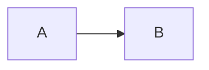

<h1 class="page__title">Markdown</h1>

<div class="page__content">

## Locations of key files/directories

* Basic config: `_quarto.yml`
* Single pages: top-level `.qmd` files (`index.qmd`, `cv.qmd`, ...)
* Collections of pages are `.qmd` files in:
  * `publications/`
  * `portfolio/`
  * `posts/`
  * `teaching/`
  * `talks/`
* Footer: `partials/footer.html`
* Static files (like PDFs): `/files/`
* Profile image: `images/profile.png`

## Tips and hints

* Each collection item is a `.qmd` file with YAML front matter (title, date, venue, etc.) that feeds both the listing pages and the individual page.
* This site uses [Quarto](https://quarto.org)'s `listing:` feature with custom templates (see `partials/listing-templates/`) to build the Publications, Talks, Teaching, Portfolio, and Blog Posts pages.
* Your CV is written directly in `cv.qmd`, combining static Markdown sections with compact listings pulled from the publications/talks/teaching collections.

## MathJax

Support for MathJax is included by default in Quarto:

$$
\begin{aligned}
\nabla \cdot E &= \frac{\rho}{\epsilon_0} \\
\nabla \cdot B &=0 \\
\nabla \times E &= -\partial_tB \\
\nabla \times B  &= \mu_0 \left(J + \varepsilon_0 \partial_t E \right)
\end{aligned}
$$

## Mermaid diagrams



## Markdown guide

### Header three

#### Header four

##### Header five

## Blockquotes

> Quotes are cool.

## Tables

| Header1 | Header2 | Header3 |
|:--------|:-------:|--------:|
| cell1   | cell2   | cell3   |
| cell4   | cell5   | cell6   |

## Unordered Lists (Nested)

* List item one
  * List item one
    * List item one
    * List item two
  * List item two
* List item two
* List item three

## Buttons

Make any link stand out more by applying the `.btn` class:

<a href="#" class="btn">Direct Link</a>

## Code

```python
print('Hello World!')
```

</div>
